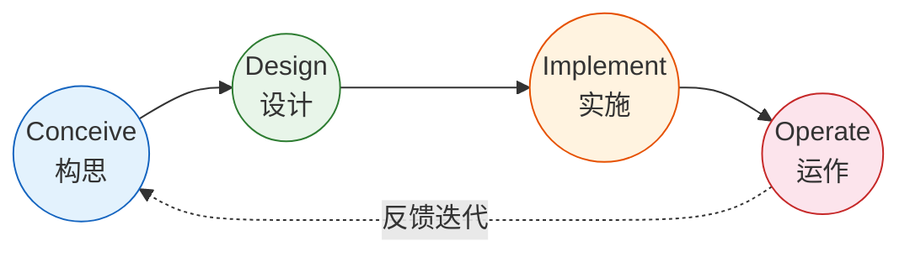
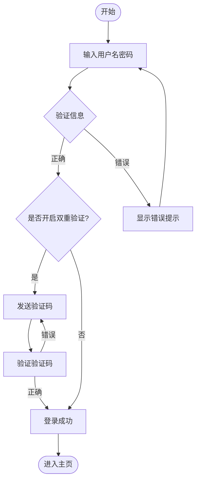
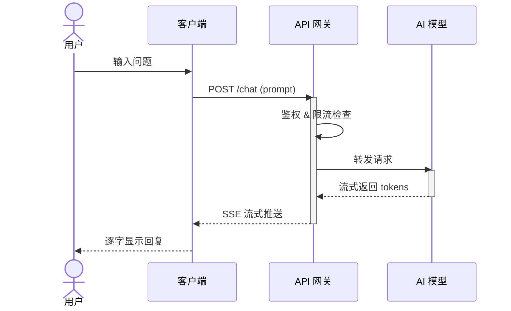
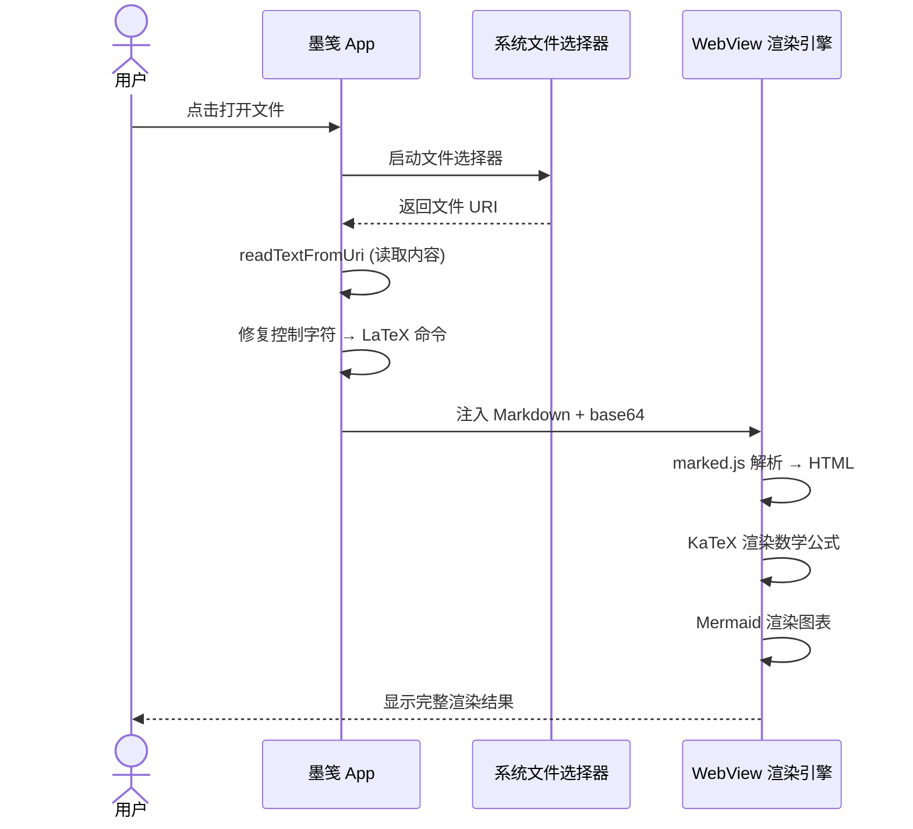
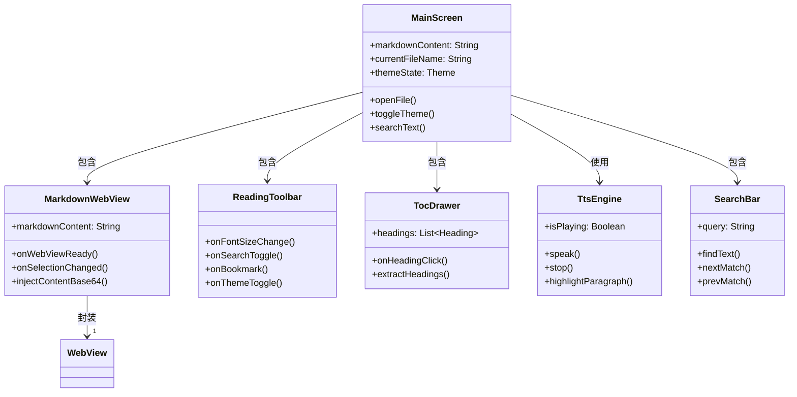
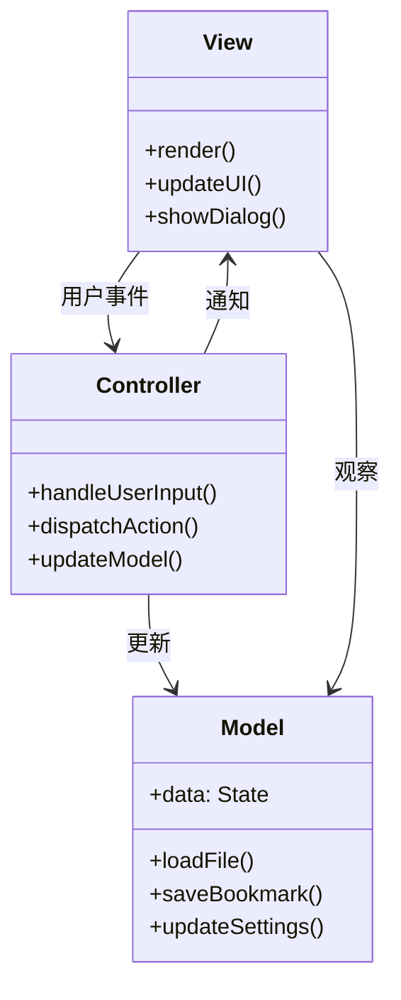
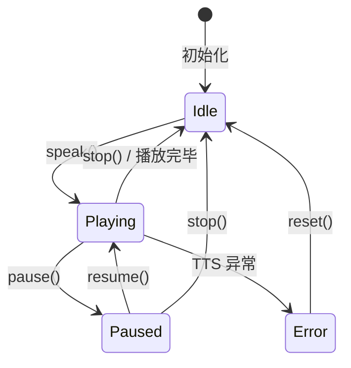
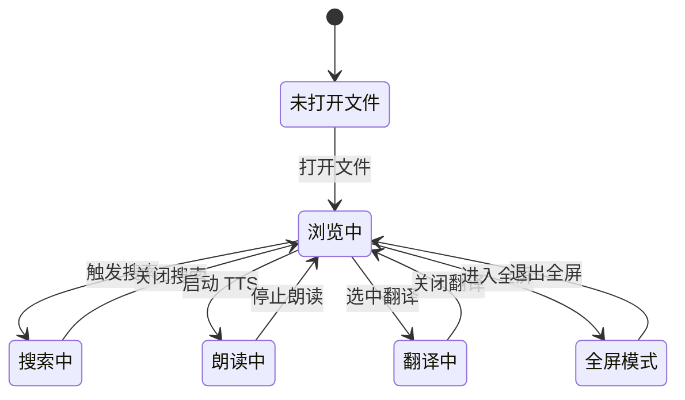

# 墨笺 渲染测试手册

> 测试 LaTeX 数学公式、Mermaid 图表（流程图/序列图/类图/状态图）、表格、代码块的完整渲染能力。

---

## 1. LaTeX 数学公式

### 1.1 行内公式

行内：已知 $Y = \beta_0 + \beta_1 X + \epsilon$，其中 $\epsilon \sim \mathcal{N}(0, \sigma^2)$。

希腊字母：$\alpha, \beta, \gamma, \delta, \theta, \lambda, \mu, \pi, \sigma, \phi, \omega, \Phi, \Delta, \Omega$

### 1.2 块级公式

**线性回归损失函数（MSE）：**

$$J(\theta) = \frac{1}{2m} \sum_{i=1}^{m} \left( h_\theta(x^{(i)}) - y^{(i)} \right)^2$$

**梯度下降更新规则：**

$$\theta_j := \theta_j - \alpha \frac{\partial}{\partial \theta_j} J(\theta)$$

**多元正态分布（概率密度函数）：**

$$f(\mathbf{x}) = \frac{1}{(2\pi)^{d/2} |\boldsymbol{\Sigma}|^{1/2}} \exp \left( -\frac{1}{2} (\mathbf{x} - \boldsymbol{\mu})^T \boldsymbol{\Sigma}^{-1} (\mathbf{x} - \boldsymbol{\mu}) \right)$$

**贝叶斯定理：**

$$P(A|B) = \frac{P(B|A) \cdot P(A)}{P(B)}$$

**矩阵乘法：**

$$\begin{bmatrix} a & b \\ c & d \end{bmatrix} \begin{bmatrix} x \\ y \end{bmatrix} = \begin{bmatrix} ax + by \\ cx + dy \end{bmatrix}$$

**傅里叶变换：**

$$\hat{f}(\xi) = \int_{-\infty}^{\infty} f(x) \ e^{-2\pi i x \xi} \ dx$$

**神经网络前向传播：**

$$a^{(l)} = \sigma\left(W^{(l)} a^{(l-1)} + b^{(l)}\right)$$

### 1.3 常用符号速查

| 类别 | 符号 | LaTeX 代码 |
|:---|:---|:---|
| 求和 | $\sum_{i=1}^{n} x_i$ | `\sum_{i=1}^{n} x_i` |
| 积分 | $\int_{0}^{\infty} f(x)dx$ | `\int_{0}^{\infty} f(x)dx` |
| 偏导 | $\frac{\partial f}{\partial x}$ | `\frac{\partial f}{\partial x}` |
| 极限 | $\lim_{x \to 0} \frac{\sin x}{x}$ | `\lim_{x \to 0} \frac{\sin x}{x}` |
| 根号 | $\sqrt{a^2 + b^2}$ | `\sqrt{a^2 + b^2}` |
| 向量 | $\vec{v}, \mathbf{A}$ | `\vec{v}, \mathbf{A}` |
| 集合 | $x \in \mathbb{R}^n$ | `x \in \mathbb{R}^n` |
| 箭头 | $\Rightarrow, \leftrightarrow$ | `\Rightarrow, \leftrightarrow` |

---

## 2. Mermaid 流程图

### 2.1 CDIO 工程教育闭环



### 2.2 用户登录流程



---

## 3. Mermaid 序列图

### 3.1 AI 对话请求流程



### 3.2 墨笺文件打开流程



---

## 4. Mermaid 类图（框架图）

### 4.1 墨笺核心架构



### 4.2 MVC 架构示意



---

## 5. Mermaid 状态图

### 5.1 TTS 朗读状态机



### 5.2 文档阅读状态



---

## 6. 代码块语法高亮

```python
def gradient_descent(X, y, theta, alpha, iterations):
    """线性回归梯度下降"""
    m = len(y)
    cost_history = []
    
    for i in range(iterations):
        # 计算预测值
        h = X @ theta
        
        # 计算梯度
        gradient = (1/m) * X.T @ (h - y)
        
        # 更新参数
        theta = theta - alpha * gradient
        
        # 记录损失
        cost = (1/(2*m)) * np.sum((h - y) ** 2)
        cost_history.append(cost)
    
    return theta, cost_history
```

```kotlin
// 墨笺：控制字符修复
private fun readTextFromUri(context: Context, uri: Uri): String {
    val sb = StringBuilder()
    context.contentResolver.openInputStream(uri)?.use { input ->
        BufferedReader(InputStreamReader(input, Charsets.UTF_8)).use { reader ->
            var line = reader.readLine()
            while (line != null) { sb.appendLine(line); line = reader.readLine() }
        }
    } ?: throw IllegalStateException("无法打开文件: $uri")
    
    // 修复被污染的 LaTeX 转义序列
    return sb.toString()
        .replace("\u000c", "\\f")   // form feed
        .replace("\u0008", "\\b")   // backspace  
        .replace("\u0007", "\\a")   // bell
        .replace("\u0009", "\\t")   // tab
        .replace("\u000d", "\\r")   // cr
}
```

---

## 7. 表格

### 7.1 版本历史

| 版本 | 日期 | 新增功能 | 修复问题 |
|:---|:---|:---|:---|
| v1.0 | 2025-05 | 基础 WebView + Markdown | - |
| v1.1 | 2025-05 | 目录导航、字体缩放 | 中文标题跳转 |
| v1.2 | 2025-05 | TTS 朗读、应用图标 | TTS 初始化 |
| v2.0 | 2025-05 | 主题切换、搜索、书签 | - |
| v2.1 | 2025-05 | AI 翻译 | 书签竞态 |
| v2.2 | 2025-05 | 高亮标注、全屏、选中朗读 | 文件名显示 |
| v2.3 | 2025-05 | 复制选中、高亮刷新 | 文件标题 |
| v2.4 | 2025-05 | **LaTeX 公式修复** | 控制字符还原 |

### 7.2 支持的语法

| 功能 | 引擎 | 状态 |
|:---|:---|:---:|
| Markdown 解析 | marked.js | ✅ |
| LaTeX 行内公式 | KaTeX | ✅ |
| LaTeX 块级公式 | KaTeX | ✅ |
| Mermaid 流程图 | Mermaid | ✅ |
| Mermaid 序列图 | Mermaid | ✅ |
| Mermaid 类图 | Mermaid | ✅ |
| Mermaid 状态图 | Mermaid | ✅ |
| 代码语法高亮 | highlight.js | 🔄 待加 |
| 表格 | marked.js | ✅ |
| 图片 | WebView | ✅ |

---

## 8. 块引用

> **重要提示：** 本文件由 Hermes Agent 生成，用于测试墨笺的完整渲染能力。
> 
> 如果你看到数学公式渲染精美、图表清晰流畅，说明修复成功 🎉
> 
> —— 2025年5月31日

---

*测试文档结束。共包含 14 个 LaTeX 公式、7 个 Mermaid 图表、2 个代码块、2 个表格。*
